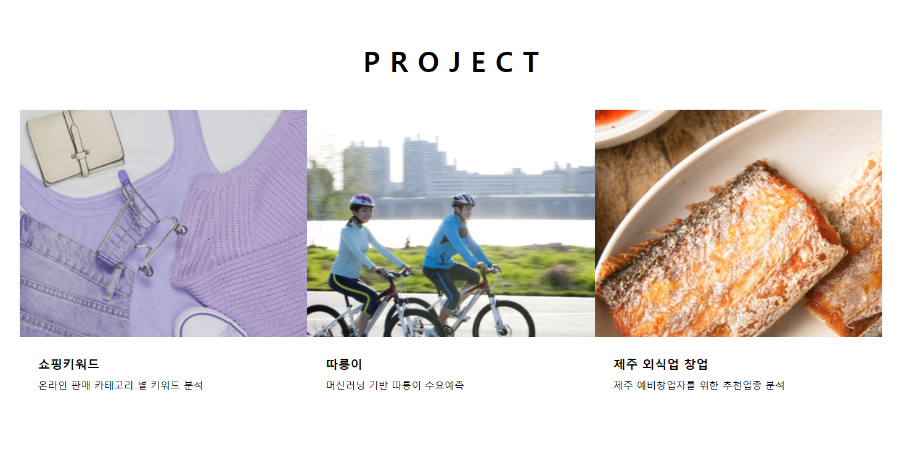

## 목차

 - [프로젝트 소개](#프로젝트-소개)
   - [쇼핑키워드](#1-쇼핑키워드)
   - [따릉이](#2-따릉이)
   - [제주 외식업 창업](#3-제주-외식업-창업)
 - [기술 스택과 개발환경](#기술-스택과-개발환경)
 - [후기](#후기)
 - [작성자 정보](#작성자-정보)

## 프로젝트 소개

python을 이용한 crowling 부터 sklearn ML project, 
효과적인 데이터시각화를 위한 flask와 dash까지  
3가지 프로젝트를 직관적으로 확인할 수 있도록 구현하였습니다.  

### #1. 쇼핑키워드  

팀원들의 공통된 관심사를 찾아 프로젝트 주제를 선정하였으며,
쇼핑키워드 검색량을 기반으로 경제적 이익 창출을 목표로 두었던 프로젝트입니다.

- 데이터 수집  
    카테고리 별 상위 키워드 (네이버 데이터랩  python Crawling)  
    키워드별 검색량, 경쟁정도 (블랙키위, 셀러마스터)  

- 데이터 분석과정   
    날짜별 키워드 검색량 통합 
    검색증가율 분석 및 경쟁률 확인  
    카테고리별 키워드 추천  
    제품검색량에 따른 기업의 주가 변화 확인  

- 결과  
    카테고리 별 추천 키워드 제공 가능  
    제품의 검색량과 기업의 주가 연관성 확인

ppt [보러가기](https://www.miricanvas.com/v/11ptcya)  
git [보러가기](https://github.com/suhuikang/pj_01_keyword/blob/main/shoppingkeyword/shoppingkeyword.ipynb)
      

### #2. 따릉이  

교통복지 측면에서 큰 사회적 가치를 창출하는 '따릉이'  
100억원이 넘는 적자를 줄이는데 기여하고자 주제선정하였습니다.  

- 분석 목표  
    시간, 일, 자치구 별 날씨 데이터와 따릉이 대여 수요의 상관관계를 찾아 모델의 학습, 평가, 강화  

- 데이터 수집 및 전처리  
    시간대별 공공자전거 이용정보 (공공데이터포털)  
    서울 자치구별 일일 기온 데이터 (기상자료개방포털)  
    대여소 코드를 활용해 자치구 columns 추가  
    월별 기온 및 대여정보 통합  
    ML학습을 위한 각 columns type 변환,columns scale조정, 학습에 방해될 데이터 제거  

- 학습 및 평가
  - Algorithm  
    예측 모델로 회귀 알고리즘 선택  
  - 평가  
    R2_score, RMSE, MSE, MAE
  

ppt [보러가기](https://www.miricanvas.com/v/11jsg3n)  
git [보러가기](https://github.com/suhuikang/pj_02_ddareung/blob/main/bigdata_3%EC%A1%B0_project_02%20(1).ipynb)  

### #3. 제주 외식업 창업

제주도창업을 고려하는 예비창업주들에게 필요한 정보를 제공하고자 주제 선정하였습니다. 

- 분석목표  
    제주 지역별 업종별 카드매출 통계 위치 및 업종 선정 정보제공 컨설팅  

- 데이터 수집 및 처리  
    지역, 소분류외식업종, 나이 별 카드매출  
    관광, 근무, 거주인구 (제주데이터허브)  
    Dash 시각화를 위한 전처리

- 결과  
    창업을 원하는 클라이언트에게 각종 데이터 별 grape 제공
    직관적인 지역별 데이터 제공 (geopandas)  

web [보러가기](file:///C:/Users/python/Downloads/fc40da00-0926-48fe-a9ef-bdfbe8d74749%20(1).pdf)

## 기술 스택과 개발환경

- 주요 프레임워크 및 라이브러리
  - python 3.9
  - Flask
  - Dash
  - pandas
  - numpy
  - Scikit-learn
  - Geopandas
  - Plotly
  

- 개발환경
  - Jupyter Notebook
  - PyCharm
## 후기

 팀 프로젝트와 개인 프로젝트를 진행하면서 프로젝트 기획부터 목표까지 모든 팀원이 이해하고 있는것이 중요하다는 것을 깨달았습니다.
때문에 팀원들과의 대화, 소통을 중요하게 생각하게 되었으며 아이디어를 나누고 문제해결방법을 찾는 긍정적인 효과를 경험하게 되어 협업의 장점을 더 크게 보게 되었습니다.  

## 작성자 정보

강수희

010-4522-5819  
su5819@naver.com

